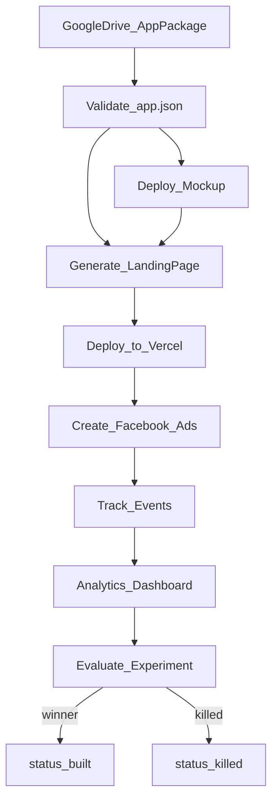

# Workflow

This document maps the end-to-end app validation pipeline to App Package fields. It describes intended behavior for future n8n workflows — nothing here is implemented in Phase 1.

## Pipeline overview

## Stage 1: Read from Google Drive

**Trigger:** New or updated folder under a configured Drive parent directory.

**Discovery rule:** Folder name must match `app.json` → `appId`.

**Read:**
- `app.json` (required)
- Files referenced by `landingPage.sections[].file`
- Files referenced by `media.*.path`
- Mockup source at `mockup.sourcePath` (if present)

**Gate:** Only process packages where `status` is `ready` unless a manual override workflow is triggered.

| Spec fields | Role |
|-------------|------|
| `appId` | Folder name, correlation ID across steps |
| `status` | Entry gate (`ready`) |
| `specVersion` | Validator selects correct schema version |

## Stage 2: Validate the package

**Goal:** Confirm the package conforms to the spec before any deploy or ad spend.

**Checks (Phase 2 validator):**
- JSON Schema validation against `schemas/app.schema.json`
- Referenced files exist on Drive
- `experiment` fully populated when `status` is `ready` or `validating`
- At least `hero` and `cta` sections enabled in `landingPage`
- Sections with `source: "media"` require `media.screenshots` with at least one entry
- Media paths resolvable (if `media` section present)
- `mockup.entryPoint` resolvable (if `mockup` section present)

**On success:**
- Fire `tracking.webhooks.validationComplete` (if set)
- Proceed to deploy stages
- Optionally set `status` to `validating`

**On failure:**
- Do not deploy or create ads
- Notify author with section-scoped errors
- Leave `status` at `ready` or revert to `draft`

| Spec fields | Role |
|-------------|------|
| All sections | Schema validation |
| `experiment` | Required for non-draft runs |
| `tracking.webhooks.validationComplete` | Success notification |

## Stage 3: Deploy interactive mockup

**Goal:** Build and deploy the mockup app so prospects can interact with the idea.

**Read from `mockup`:**
- `sourcePath`, `framework`, `entryPoint`
- `installCommand`, `buildCommand`, `devCommand`, `deployCommand`

**Write back:**
- `mockup.previewUrl`
- `deployment.mockupUrl`

| Spec fields | Role |
|-------------|------|
| `mockup.*` | Build and deploy instructions |
| `deployment.mockupUrl` | Automation output |
| `branding` | Theme tokens for mockup styling (consumer-dependent) |

## Stage 4: Generate landing page

**Goal:** Produce a premium landing page from package content.

**Inputs:**
- `landingPage.sections` — order, enabled flags, inline vs file vs media copy
- `copy/*.md` — long-form markdown sections
- `media.screenshots` — rendered when a section has `id: "screenshots"` and `source: "media"`
- `commerce` — pricing display, CTA labels
- `branding` — colors, tone
- `media` — icons, screenshots, og image
- `identity` — app name, tagline, description
- `deployment.mockupUrl` or `mockup.previewUrl` — link to live mockup

**Output:** Static site or framework project ready for Vercel deploy.

| Spec fields | Role |
|-------------|------|
| `landingPage` | Structure and copy sources |
| `landingPage.seo` | Meta title, description, keywords |
| `commerce.cta` | Button labels |

## Stage 5: Deploy landing page to Vercel

**Goal:** Publish the landing page and record live URLs.

**Write back:**
- `deployment.landingPageUrl`
- `deployment.vercelProjectId`
- `deployment.vercelDeploymentUrl`
- `deployment.githubRepoUrl` (if a repo is created)
- `deployment.lastDeployedAt` (ISO 8601 timestamp)

**On success:** Fire `tracking.webhooks.deployComplete` (if set).

| Spec fields | Role |
|-------------|------|
| `landingPage.slug` | URL path on Vercel |
| `deployment.*` | Automation output |

## Stage 6: Create Facebook ads

**Goal:** Launch paid social campaigns to drive traffic to the landing page.

**Read from `ads`:**
- `campaignName`, `objective`, `platforms`
- `headlines`, `primaryTexts`, `descriptions`
- `callToAction`, `utmTemplate` (structured object or legacy string)

**Also use:**
- `deployment.landingPageUrl` as destination
- `media.ogImage`, `media.screenshots` for creatives
- `identity.tagline`, `identity.appName` for fallbacks

**Budget:** Respect `experiment.testBudget.amount` and `durationDays`.

| Spec fields | Role |
|-------------|------|
| `ads` | Ad copy and campaign config |
| `experiment.testBudget` | Spend and duration caps |
| `analytics.*` | Campaign attribution IDs |

## Stage 7: Track emails and Buy Now clicks

**Goal:** Capture conversion events and forward to webhooks and analytics.

**Events:**
- `email_captured` → `tracking.webhooks.emailCaptured`
- `buy_now_clicked` → `tracking.webhooks.buyNowClicked`
- Custom events from `tracking.events`

**Attribution:** Expand `ads.utmTemplate` (object or string) and tag events with `analytics.experimentId` for dashboard routing.

| Spec fields | Role |
|-------------|------|
| `tracking.webhooks` | Event fan-out endpoints |
| `tracking.events` | Custom event catalog |
| `analytics` | Dashboard routing |

## Stage 8: Feed analytics dashboard

**Goal:** Aggregate experiment metrics for decision-making.

**Key dimensions:**
- `analytics.projectId`
- `analytics.experimentId`
- `analytics.funnelName`
- `analytics.customDimensions`

**Compare results against:**
- `experiment.successCriteria`
- `experiment.decisionRules.winnerThreshold`
- `experiment.decisionRules.killThreshold`
- `experiment.decisionRules.minSampleSize`

## Stage 9: Experiment decision

**Goal:** Promote winners and kill underperformers.

| Outcome | Action |
|---------|--------|
| Winner | Set `status` to `winner`; pause or scale ads per playbook |
| Kill | Set `status` to `killed`; stop ads; archive package |
| Inconclusive | Set `status` to `paused`; follow `decisionRules.notes` |
| Ship product | After building real app, set `status` to `built`; populate `appStore` |

## Status transitions by stage

| Stage | Who sets status | Typical value |
|-------|-----------------|---------------|
| Authoring | Human | `draft` |
| Pre-flight approval | Human | `ready` |
| Validation + ads live | Automation | `validating` |
| Manual hold | Human | `paused` |
| Decision | Automation or human | `winner` / `killed` |
| Production ship | Human | `built` |

## Package profiles in the pipeline

| Profile | When used | Pipeline behavior |
|---------|-----------|-------------------|
| Minimal | Early ideation | Stages 2+ blocked until expanded; `status` stays `draft` |
| Ready | Pre-launch | Full validation; deploy and ads proceed |
| Full | Reference / production validation | All assets and copy available to generators |

See [examples/minimal-app/](../examples/minimal-app/) and [examples/full-app/](../examples/full-app/).

## Related documents

- [n8n-integration-notes.md](n8n-integration-notes.md) — Drive layout, parse paths, write-back
- [APP_PACKAGE_SPEC.md](../APP_PACKAGE_SPEC.md) — field definitions
- [design-philosophy.md](design-philosophy.md) — why the spec is shaped this way
